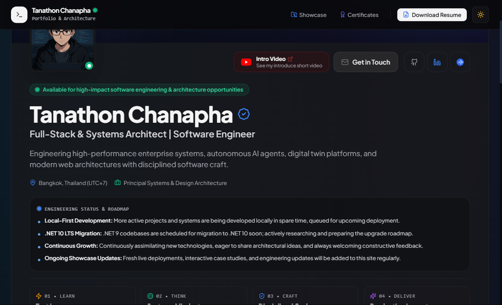
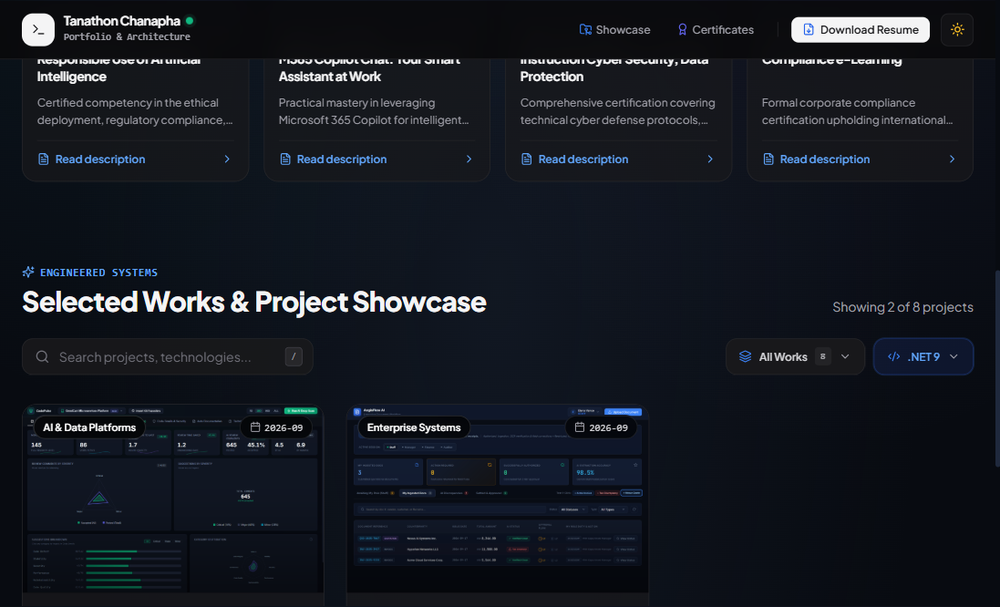
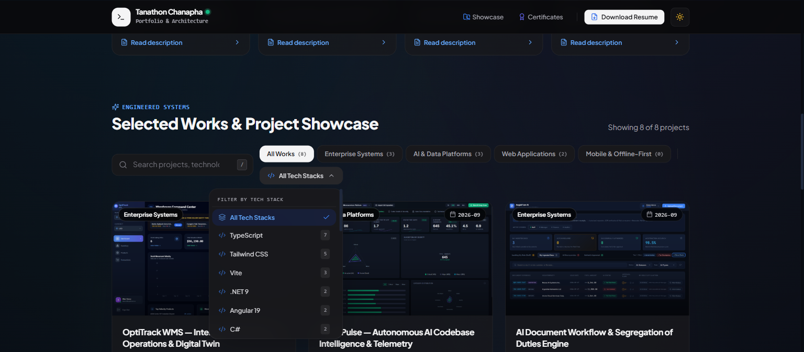
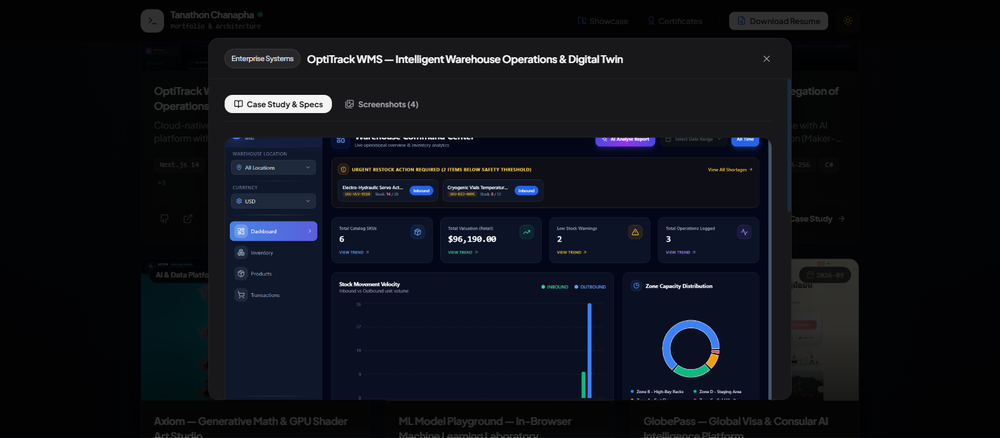
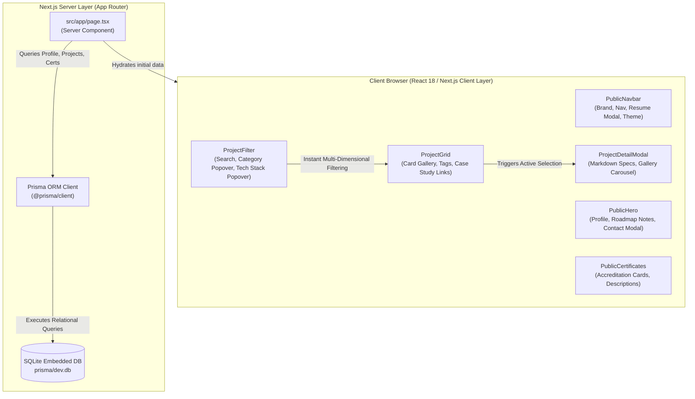

# Tanathon Chanapha — Personal Engineering Portfolio & Showcase Cockpit

<div align="center">

[](https://portfolio-tanathon.vercel.app)
[](https://nextjs.org/)
[](https://www.typescriptlang.org/)
[](https://tailwindcss.com/)
[](https://www.prisma.io/)
[](https://www.sqlite.org/)
[](https://playwright.dev/)
[](LICENSE)

**Bespoke personal portfolio cockpit crafted for self-use (ทำใช้เอง) — showcasing enterprise cloud platforms, AST code analyzers, digital twins, and corporate accreditations.**

[🌐 Live System Demo](https://portfolio-tanathon.vercel.app) • [Architectural Pillars](#-system-architecture) • [Engineering Showcase](#-selected-works-gallery) • [Local Setup](#-quickstart--local-development)

</div>

---

## 🏛️ 1. Who (Target Audience & Project Scope)

- **Primary Scope: Personal / Self-Use (ทำใช้เอง)**:
  - Built by and for **Tanathon Chanapha** as a dedicated personal engineering cockpit and single-tenant portfolio hub.
  - Designed for personal cataloging: tracking self-developed production systems, logging in-progress prototypes on local environments, and managing enterprise systems architecture (.NET 10 LTS, Angular Signals, and modern cloud stacks).
  - Eliminates reliance on cookie-cutter SaaS templates (Wix, Notion, Linktree), providing 100% data ownership, zero subscription overhead, and bespoke instrument-grade UX.
- **Secondary Stakeholders (Public Reviewers & Visitors)**:
  - **Tech Leads & Principal Architects**: Evaluating systems design mindset, code discipline, AST comprehension, and end-to-end full-stack capabilities.
  - **Engineering Hiring Managers & CTOs**: Reviewing enterprise-grade production applications (.NET 10, Angular 19/21, React 19, Next.js 14, WebGL2, TensorFlow.js).
  - **Engineering Peers & Recruiters**: Accessing verified professional accreditations (Krones AG Germany), interactive contact dialog, and verified resume artifacts.

---

## ⚠️ 2. The Problem (Why Build a Personal System?)

Commercial portfolio builders and generic website templates fail to meet specific engineering needs:
1. **Generic Cookie-Cutter Layouts**: Standard site builders cannot represent multi-dimensional engineering taxonomies (.NET 10, Angular 19/21 Signals, WebGL2 shaders, AST telemetry) or interactive PDF modal inspection.
2. **Cluttered & Inflexible Navigation**: Pre-made templates clutter screens with endless tag pills or clunky native selects that break on mobile and lack category/stack dual-filtering.
3. **Lack of Zero-Config Self-Hosting**: Most platforms demand expensive SaaS subscriptions or inject branding, whereas a self-built Next.js + SQLite stack runs with zero overhead and full data control.

---

## 💡 3. The Solution (Personal Cockpit Architecture)

**Tanathon Chanapha Personal Portfolio Platform** solves these challenges through a unified, instrument-grade personal architectural showcase:
- **Personal Cataloging (ทำใช้เอง)**: Instant tracking of finished works, prototypes in active development, and enterprise production systems (.NET 10 LTS & modern distributed architectures).
- **10 Authentic Production Systems**: Directly synchronized with GitHub repositories (`ZillerDX`), featuring high-resolution screenshot galleries, production URLs, and architecture whitepapers.
- **Dual Synchronized Filter Popovers**: "All Works" category dropdown and dynamic "All Tech Stacks" popover aligned on the same horizontal level, eliminating screen clutter while providing sub-second multi-dimensional filtering.
- **Glassmorphic Instrument Design**: Built with modern CSS design tokens, custom SVG vector icons, dark/light ambient mesh gradients, and defensive UI UX (zero cumulative layout shifts).

---

## ✨ 4. Key Functional Capabilities

| Feature | Architectural Implementation |
| :--- | :--- |
| **Dual Filter Popovers** | Custom WCAG-compliant dropdown menus for **Category** and **Tech Stack** with live project counts and instant reset. |
| **Case Study Modal** | Centered modal popup rendering Markdown specifications, technical architecture pillars, and multi-screenshot galleries. |
| **Interactive Contact** | Dedicated email dialog with 1-click clipboard copy (`chanapha.tanathon@gmail.com`) and instant checkmark feedback. |
| **Verified Accreditations** | Interactive certification gallery featuring official credentials from **Krones AG (Germany)**. |
| **Embedded Resume Viewer** | Floating docked action bar with instant in-browser modal PDF inspection and download capabilities. |
| **Engineering Dispatch** | Real-time status bulletin tracking local development prototypes and planned **.NET 10 LTS** migrations. |

---

## 📸 5. Visual Demonstration

### A. Executive Profile & Engineering Dispatch


### B. Clean Dual Dropdowns (All Works & All Tech Stacks Aligned)


### C. Custom Tech Stack Popover Filter with Dynamic Counts


### D. Detailed Case Study & Architectural Specifications Modal


---

## 🛠️ 6. Technology Stack & Rationale

```
Frontend Architecture       Next.js 14.2 (App Router) + React 18 + TypeScript 5.6
Styling & Tokens            Tailwind CSS 3.4 + Custom Ambient Mesh Utilities
ORM & Persistence           Prisma ORM 5.22 + SQLite (Embedded Zero-Config Database)
Markdown Engine             React-Markdown + Remark-GFM (GitHub Flavored Markdown)
Icons & Typography          Lucide React + Plus Jakarta Sans + JetBrains Mono
Quality & Verification      Headless Playwright Visual Auditing (0 Console Errors)
Deployment Target           Vercel Serverless / Node.js Standalone
```

---

## 📐 7. System Architecture



---

## 📂 8. Selected Works Portfolio Matrix

| Project | Domain | Key Architecture & Tech Stack | Live Demo / Repository |
| :--- | :--- | :--- | :--- |
| **QueueFlow** | Enterprise Systems | .NET 10 LTS, C# 14 Minimal APIs, Angular 19 Signals, SignalR WebSockets, PostgreSQL | [Live App](https://queueflow-wheat.vercel.app) • [GitHub](https://github.com/ZillerDX/QueueFlow) |
| **DeskFlow Rooms** | Enterprise Systems | .NET 10 LTS, C# 14 Minimal APIs, Angular 21 Signals, SignalR WebSockets | [Live App](https://deskflow-three-mauve.vercel.app/) • [GitHub](https://github.com/ZillerDX/deskflow) |
| **EquipLend** | Enterprise Systems | .NET 10 LTS, C# 14 Minimal APIs, React 19, Tailwind CSS | [Live App](https://equiplend.vercel.app/) • [GitHub](https://github.com/ZillerDX/equiplend) |
| **OptiTrack WMS** | Enterprise Systems | Next.js 14, TypeScript, FastAPI, Python, 2D/3D SCADA Digital Twin | [Live App](https://optitrack-wms.vercel.app) • [GitHub](https://github.com/ZillerDX/Optitrack-WMS) |
| **CodePulse** | AI & Data Platforms | .NET 10 Minimal APIs, C# 14, Angular 19 Standalone Signals, AST Telemetry | [Live System](https://zillerdx.github.io/ai-codebase-intelligence/) • [GitHub](https://github.com/ZillerDX/ai-codebase-intelligence) |
| **AI Document Workflow** | Enterprise Systems | .NET 10, C# 14, Angular 19, WebCrypto SHA-256 Cryptographic Audit Chaining | [Live System](https://zillerdx.github.io/ai-document-workflow/) • [GitHub](https://github.com/ZillerDX/ai-document-workflow) |
| **Axiom (Math Studio)** | AI & Data Platforms | WebGL2, GLSL Shaders, React, TypeScript, GPU Raymarching | [Live Lab](https://zillerdx.github.io/math-generative-art-studio/) • [GitHub](https://github.com/ZillerDX/math-generative-art-studio) |
| **ML Model Playground** | AI & Data Platforms | TensorFlow.js, React 18, TypeScript, In-Browser Neural Networks | [Live Playground](https://zillerdx.github.io/ml-model-playground/) • [GitHub](https://github.com/ZillerDX/ml-model-playground) |
| **GlobePass** | Web Applications | Next.js 14, TypeScript, FastAPI, Python, 227-Country Consular Telemetry | [Live App](https://globepass-visa.vercel.app) • [GitHub](https://github.com/ZillerDX/globepass-visa) |
| **QR-Menu Easy Order** | Web Applications | React, TypeScript, Tailwind CSS, Local-First Restaurant KDS | [Live App](https://qr-menu-easy-order.vercel.app) • [GitHub](https://github.com/ZillerDX/QR-Menu-Easy-Order) |

---

## 🚀 9. Quickstart & Local Development

### Prerequisites
- **Node.js**: v18.18+ or v20+
- **npm** or **pnpm**

### Installation & Run
```bash
# 1. Clone the repository
git clone https://github.com/ZillerDX/portfolio-showcase.git
cd portfolio-showcase

# 2. Install dependencies
npm install

# 3. Generate Prisma Client
npx prisma generate

# 4. Start local development server
npm run dev
```

Open [http://localhost:3000](http://localhost:3000) in your browser.

### Production Build & Verification
```bash
# Typecheck
npx tsc --noEmit

# Production Build
npm run build

# Start Production Server
npm run start
```

---

## 🌐 10. Deployment & Live Production (Vercel)

This application is built with **Next.js 14 App Router** and **Prisma SQLite**, optimized for high-performance deployment on **Vercel** with full Static Site Generation (SSG) and Incremental Static Regeneration (ISR):

- **Production Live URL**: [https://portfolio-tanathon.vercel.app](https://portfolio-tanathon.vercel.app)
- **Continuous Deployment**: Connected to `main` branch on GitHub; every push triggers automatic build verification and Edge CDN caching.

---

## 👤 Author & Architecture

**Tanathon Chanapha**  
*Full-Stack & Systems Architect | Software Engineer*  
- **Email**: [chanapha.tanathon@gmail.com](mailto:chanapha.tanathon@gmail.com)  
- **GitHub**: [@ZillerDX](https://github.com/ZillerDX)  
- **LinkedIn**: [Tanathon Chanapha](https://www.linkedin.com/in/tanathon-chanapha-452177427)  
- **Jobsdb**: [Profile](https://th.jobsdb.com/th/profiles/tanathon-chanapha-R26rW062z5)  
